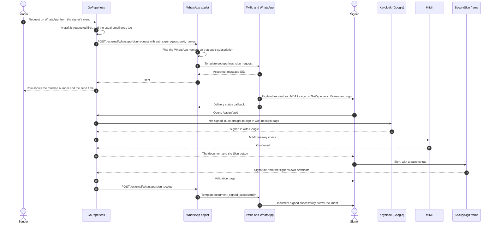
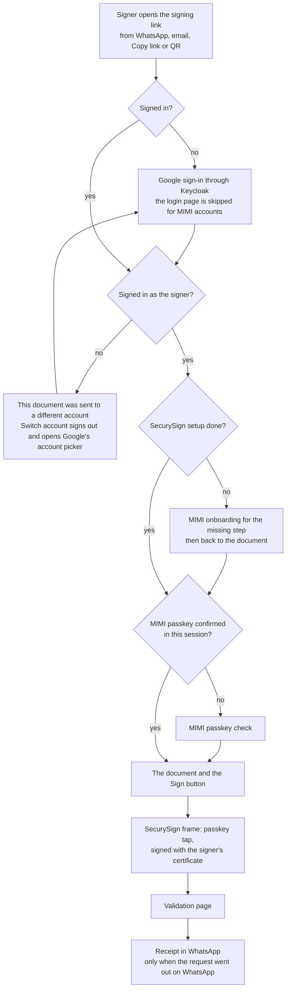
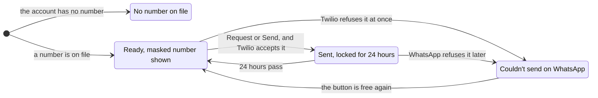
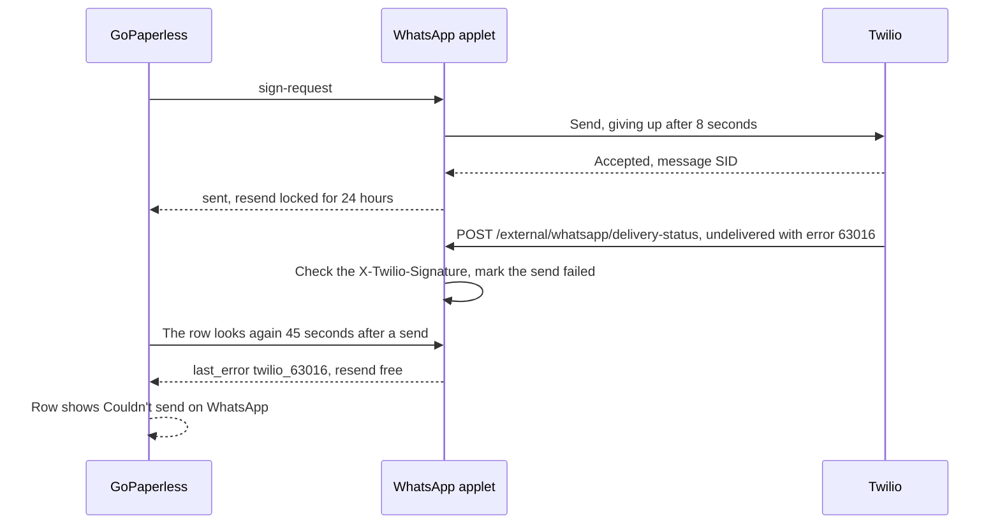

# WhatsApp signing requests: the workflow

A sender asks an existing MIMI user to sign from the signer list, and the request
arrives on the signer's WhatsApp. The signer taps **Review and sign**, signs in
with Google, confirms their MIMI passkey, reads the document and signs in
SecurySign's frame with their own certificate. A "Document signed" receipt then
arrives in the same chat.

Status on 2026-10-07: built and tested end to end on a local stack, not deployed.
The code is on `feature/fast-signing` (this repo) and
`feature/whatsapp-sign-requests` (`gopaperless`, the payments service and
WhatsApp applet). The request template is approved by Meta.

## Who does what

| Part | Role in this flow |
| --- | --- |
| GoPaperless (this repo) | The signer row actions (Request on WhatsApp, Copy link, Show QR), the signing page, the sign-in, setup and passkey checks |
| Payments service and WhatsApp applet (`gopaperless` repo) | Looks up the signer's number, sends through Twilio, enforces one request per signer per 24 hours, sends the receipt, records every message |
| Twilio and WhatsApp | Deliver the approved templates and report delivery back |
| Keycloak (Google) | Signs the signer in |
| MIMI | The passkey check before the document opens |
| SecurySign | Signs in its own frame, with the signer's certificate and a second passkey tap |

GoPaperless never holds a full phone number. It names the signer by their OIDC
`sub`, and the payments service looks the number up on that account's
subscription, where MIMI put it at payment.

## End to end

## The signer's path

Every way in (WhatsApp, email, Copy link, a scanned QR) opens the same page and
ends on the same validation page.

The wrong-account screen never shows which account the document was sent to.

## The sender's signer row

Under the signer's name the row shows the masked number (`+254 7•• ••• 166`), or
why WhatsApp is unavailable. The menu offers **Request on WhatsApp** (on a draft)
or **Send on WhatsApp**, plus **Copy link** and **Show QR** once the link works.

The button is also disabled, with the reason, when it is not the signer's turn
in a sign order, when the signer is a password account, or when GoPaperless has
not yet seen the signer sign in.

## When WhatsApp refuses a message

Twilio accepting a message is not WhatsApp delivering it. A number with no
WhatsApp is refused a few seconds later. Without an approved template, so is any
message to someone who has not written to us in the last 24 hours.

## Assumptions

| # | Assumption | What it means | Open? |
| --- | --- | --- | --- |
| 1 | The signer already has a GoPaperless account from the MIMI sign-in. | For anyone else the button is disabled with "WhatsApp needs a MIMI account". | Yes: what happens for new users |
| 2 | The M-Pesa number MIMI collects at payment is the signer's WhatsApp number. | Nothing checks it. A number without WhatsApp ends as "Couldn't send on WhatsApp". | |
| 3 | The number lives on the payments service's subscription for that account's `sub`. | MIMI sends it with every payment. Accounts that paid before 2026-07-28 (migration `030`) or through the website's older flow have none. | Yes: let signers confirm a number in MIMI |
| 4 | GoPaperless never sees the full number. | The sender sees it masked. Only partners named in `WHATSAPP_SIGN_PARTNERS` may ask, because the lookup reads subscriptions bought through MIMI's partner key. | |
| 5 | Paying through MIMI counts as agreeing to WhatsApp messages. | Meta only allows business-started messages to people who opted in. | Yes: a line under MIMI's payment field |
| 6 | WhatsApp goes out only when the sender clicks. | No automatic message on reminders or when a signer's turn comes. One per signer per 24 hours; a failed send does not count. | |
| 7 | Request on WhatsApp on a draft requests the whole document. | The same as "Request signatures". LibreSign cannot request one signer of a draft. | |
| 8 | Messages are free to senders for now. | Every attempt is a row in `whatsapp_messages`, so we can price it later. | Yes: pricing |
| 9 | English only. | Swahili means two more template approvals. | |
| 10 | Single documents only. | SecurySign cannot sign envelopes, so the three actions are hidden there. | |
| 11 | The MIMI passkey check is mandatory on a signing link. | Two passkey taps per signature: MIMI's check, then SecurySign's frame. | |
| 12 | Google sign-in decides who may open the document. | The signed-in account must be the signer, or the wrong-account screen shows. | |
| 13 | Senders find other people only by their full email address. | Partial matches only find yourself and people you have sent documents to (privacy rule from #25), and the Email identification method must be on. | |
| 14 | The template buttons point at production. | `https://gopaperless.ke/apps/libresign/...` with no `/index.php`, fixed when Meta approved them. | |
| 15 | Hash-only clients are a separate workflow. | When the client keeps the document and sends only a hash, GoPaperless cannot build the PDF signature. Not covered here. | Yes |

## Before go-live

| Where | Setting |
| --- | --- |
| Payments service | `WHATSAPP_TEMPLATE_SIGN_REQUEST=HX6d1d3bf0059a9691c779e5561c9941c3` (`gopaperless_sign_request`, approved as Utility) |
| Payments service | `WHATSAPP_TEMPLATE_SIGN_RECEIPT=HX1da175d1f4390bf449864a061a5ad7ec` (`document_signed_successfully`, already approved) |
| Payments service | `WHATSAPP_STATUS_CALLBACK_URL=https://gopaperless.astralyngroup.com/external/whatsapp/delivery-status` |
| Payments service | `PARTNER_API_KEYS` includes `gopaperless:<key>` |
| GoPaperless | `occ config:app:set libresign whatsapp_enabled --value 1 --type boolean` |
| GoPaperless | `whatsapp_api_url` and `whatsapp_api_key` (sensitive) pointing at the payments service |
| GoPaperless | The Email identification method enabled, so senders can find signers by email |

Settings, templates and local testing in detail: `docs/runbooks/whatsapp-signing-requests.md`
on `feature/fast-signing`.
